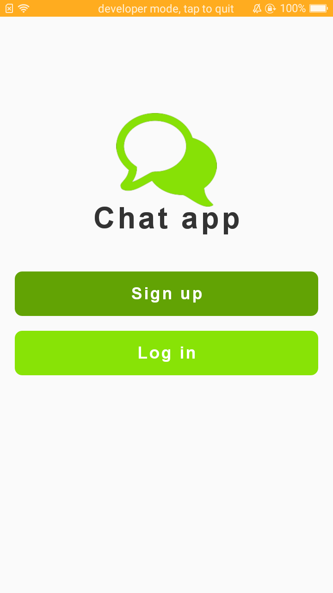
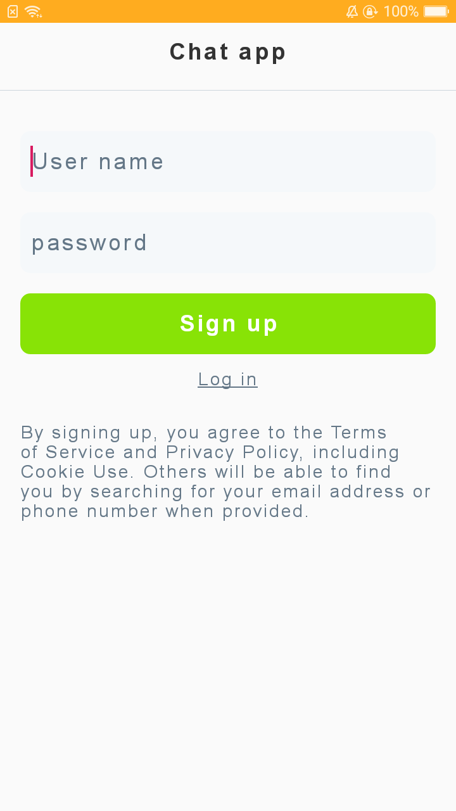
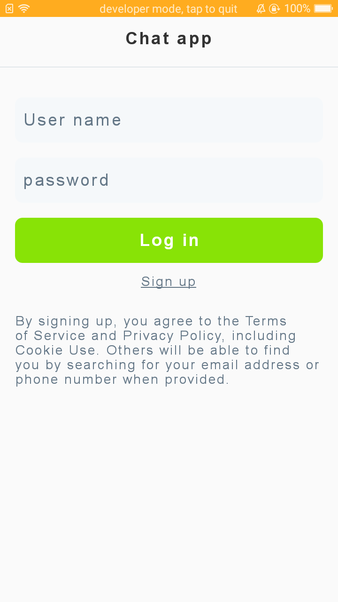
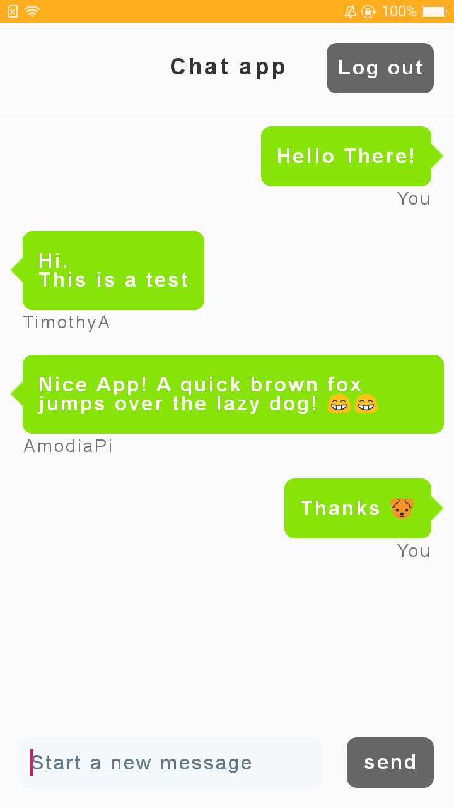
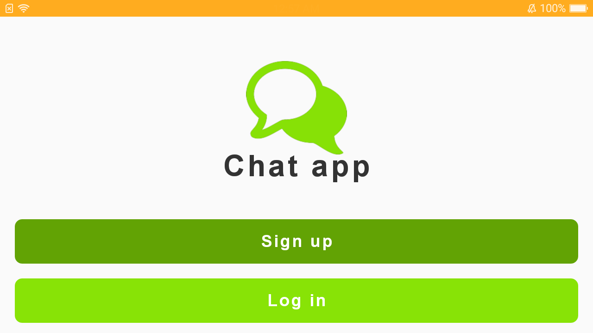
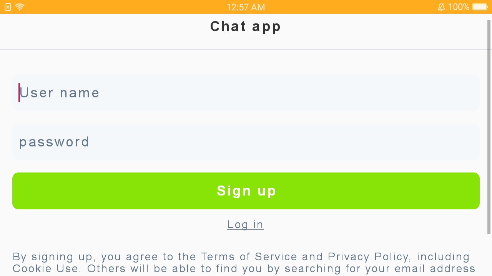
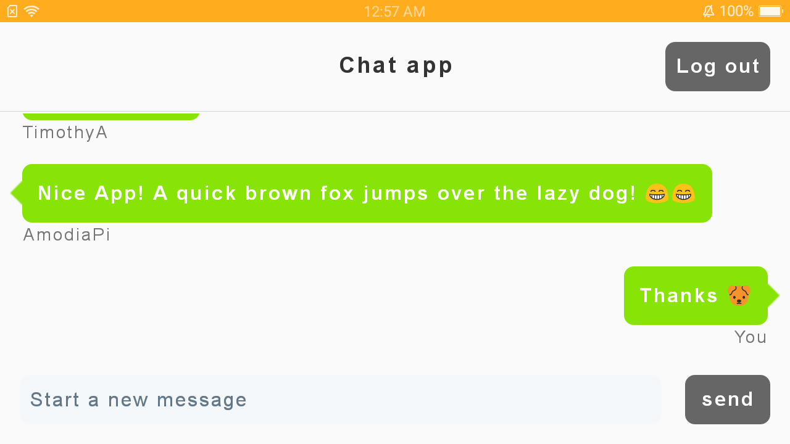

# lig-chat-app
Simple chat app in android
 
 
<h5> Everything listed in the specifications is implemented in this project.</h5>
 
 
<h5> used Firebase Authentication for convenience and security of handling accounts. </h5>
 
<h5> used Firebase Realtime Database to store the messages and sender's name.</h5>
 
 
<h5> The data from the database is observed by a recyclerview </h5>
 
<h5> and is notified everytime time a new message is received.</h5>
 
 
--
Screenshots
 
<h5> Portrait</h5>

<h5> Landscape</h5>

