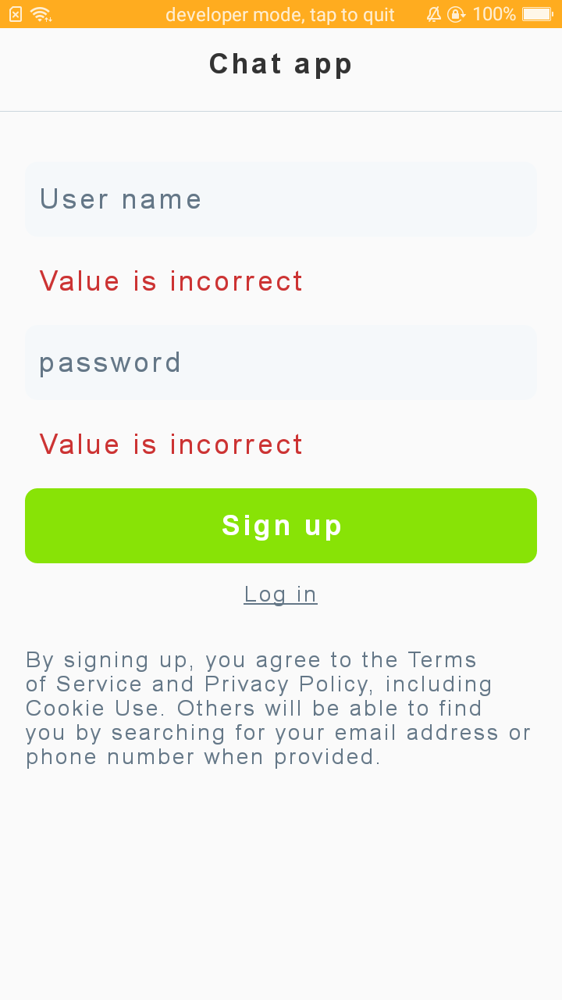

# lig-chat-app
Simple chat app in android

Everything listed in the specifications is implemented in this project.

used Firebase Authentication for convenience and security of handling accounts.  
used Firebase Realtime Database to store the messages and senders.

--
### Screenshots
<h5> Portrait</h5>

 

 

 

 

 

<h5> Landscape</h5>

 

 

 
